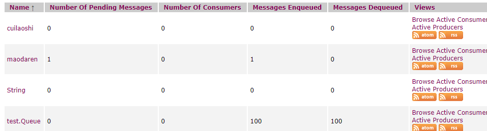

作业内容：

搭建 ActiveMQ 服务，基于 JMS，写代码分别实现对于 queue 和 topic 的消息生产和消费，代码提交到 github。

创建topic: test.topic, 队列test.Quque.

生产100条消息，并消费：

以Queue的消费日志中，消费第99条和第100条为例：

```
...
99 received from queue://test.Queue: ActiveMQTextMessage {commandId = 104, responseRequired = false, messageId = ID:DESKTOP-RA3DBVG-64751-1618142621855-3:1:1:1:99, originalDestination = null, originalTransactionId = null, producerId = ID:DESKTOP-RA3DBVG-64751-1618142621855-3:1:1:1, destination = queue://test.Queue, transactionId = null, expiration = 0, timestamp = 1618142624054, arrival = 0, brokerInTime = 1618142624055, brokerOutTime = 1618142624057, correlationId = null, replyTo = null, persistent = false, type = null, priority = 4, groupID = null, groupSequence = 0, targetConsumerId = null, compressed = false, userID = null, content = org.apache.activemq.util.ByteSequence@57ba3047, marshalledProperties = org.apache.activemq.util.ByteSequence@2ae8da0e, dataStructure = null, redeliveryCounter = 0, size = 0, properties = {id=99}, readOnlyProperties = true, readOnlyBody = true, droppable = false, jmsXGroupFirstForConsumer = false, text = abcdefghijklmnopqrstuvwxyzabcdefghijklmnopqrs...klmnopqrstuv}
100 received from queue://test.Queue: ActiveMQTextMessage {commandId = 105, responseRequired = false, messageId = ID:DESKTOP-RA3DBVG-64751-1618142621855-3:1:1:1:100, originalDestination = null, originalTransactionId = null, producerId = ID:DESKTOP-RA3DBVG-64751-1618142621855-3:1:1:1, destination = queue://test.Queue, transactionId = null, expiration = 0, timestamp = 1618142624054, arrival = 0, brokerInTime = 1618142624055, brokerOutTime = 1618142624057, correlationId = null, replyTo = null, persistent = false, type = null, priority = 4, groupID = null, groupSequence = 0, targetConsumerId = null, compressed = false, userID = null, content = org.apache.activemq.util.ByteSequence@4e2dc769, marshalledProperties = org.apache.activemq.util.ByteSequence@7267bcb8, dataStructure = null, redeliveryCounter = 0, size = 0, properties = {id=100}, readOnlyProperties = true, readOnlyBody = true, droppable = false, jmsXGroupFirstForConsumer = false, text = abcdefghijklmnopqrstuvwxyzabcdefghijklmnopqrs...klmnopqrstuv}

```

从activemq的控制台，可以看到Quque的生产和消费情况




